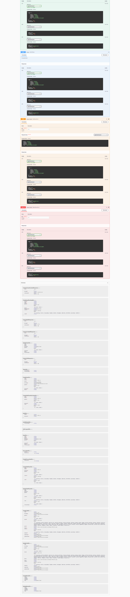

<div align="center">
  <a href="https://6003-cem-webapi-frontend.vercel.app/">
    
    <h1 align="center">6003-CEM-WEBAPI <br />BACKEND PROJECT</h1>
  </a>
</div>

<p align="center">
  Live Demo
</p>

<p align="center">
  <a href="https://6003cem-webapi-backend.azurewebsites.net/"><strong>Demo</strong></a>
  <br />
  OR
  <br />
  <a href="https://6003cem-webapi-backend.azurewebsites.net/"><strong>https://6003cem-webapi-backend.azurewebsites.net/</strong></a>
</p>
<br/>

## Introduction

This is a web application for matching shelter cats with new owners. It also comes with back office management. Frontend using Next.js [Github](https://github.com/kjjkjjzyayufqza/6003CEM-WEBAPI-FRONTEND).

## How to run

```bash
npm i
```

```bash
npm start
```

## Features

- **Authentication management** : The JWT token is used globally for authentication, and has both accessToken and refreshToken, and also supports refreshToken for refresh.

- **Cats** : Use filters (breed, name, adopted or not) to show cats. Staff can create, edit, delete cats.

- **News** : Create a News.

- **Membership** : Available for registered users and staff (code required).

- **Favorites** : Registered users can add any favorite cats to their list and also support editing.

- **Reservation** : Registered users can make an appointment to meet with a specified cat at the shelter. At the same time, you can view the past appointment records on the webpage.

- **Appointment** : Create/Edit/Delete Appointment.

### Frameworks

- [Nest.js](https://github.com/nestjs/nest) – A progressive Node.js framework for building efficient and scalable server-side applications.

## Author

- Moovoo ([@Moovoo](https://github.com/kjjkjjzyayufqza))

## Screen



